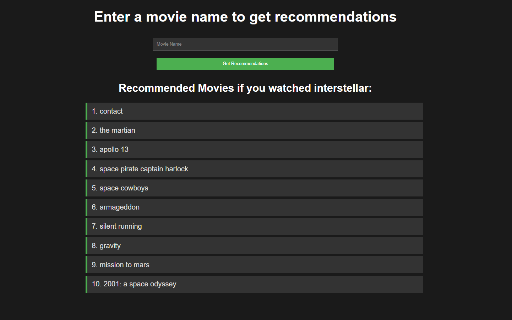
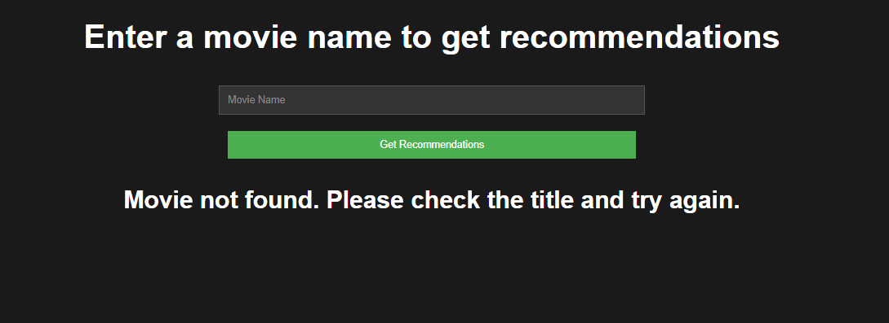

# Movie Recommendation Web App

## Overview
This project is a **content-based movie recommendation system** deployed as a **Flask web application**.  
The system recommends similar movies based on movie metadata and plot information instead of user ratings.

It demonstrates the full ML workflow:
- data preprocessing
- feature engineering
- text vectorization
- similarity-based recommendation
- deployment using Flask




---

## Dataset
**Source:** TMDB 5000 Movies Dataset (Kaggle)

The dataset contains:
- Movie titles
- Plot overviews
- Genres
- Keywords
- Cast information
- Crew information (director)

---

## Project Structure

```
movie_recommendation/
│
├── app/
│ ├── app.py # Flask application
│ ├── recommender.py # Recommendation logic
│ └── templates/
│   └── index.html # Web UI
│
├── src/
│ └── build_model.py # Data preprocessing & model building
│
├── data/
│ ├── tmdb_5000_movies.csv
│ └── tmdb_5000_credits.csv
│
├── model_data/
│ ├── data.pkl # Processed movie data
│ └── tfidf_matrix.pkl # TF-IDF feature matrix
│
├── notebook/
│ ├── rec.ipynb
│ └── test.ipynb
│
├── README.md
└── requirements.txt
```


---

## Approach
- Merged movie and credits datasets
- Selected meaningful features: genres, keywords, cast, director, and overview
- Used only the top 3 cast members to reduce noise
- Extracted only the director from crew data
- Normalized names by removing spaces to treat them as single tokens
- Combined all features into a single text column (`tags`)
- Converted text data into numerical vectors using **TF-IDF**
- Computed **cosine similarity on demand** for recommendations
- Deployed the system using **Flask**

---

## Recommendation Logic
1. Convert movie content into TF-IDF vectors
2. When a movie title is provided:
   - Compute cosine similarity between the selected movie and all other movies
   - Sort similarity scores
   - Return the top most similar movies (excluding the input movie)

The system avoids precomputing a full similarity matrix, improving space efficiency.

---

## Time and Space Optimization
- Cosine similarity is computed **on demand**
- Space complexity reduced from **O(n²)** to **O(n)**
- Suitable for small to medium-sized datasets

This approach maintains recommendation quality while improving scalability.

---

## Web Application
The Flask app provides a simple interface where users can:
- Enter a movie name
- Receive a list of recommended movies based on content similarity

The application:
- Loads precomputed artifacts (`data.pkl`, `tfidf_matrix.pkl`) once at startup
- Does not retrain or recompute TF-IDF during requests
- Separates model logic from web logic

---

## Example Usage
Enter movie name: Interstellar

The application returns a list of similar movies based on content similarity.

---

## Technologies Used
Python, Pandas, NumPy, Scikit-learn, Flask, Joblib

---

## How to Run

### 1. Install dependencies
pip install -r requirements.txt


### 2. Build the model artifacts
python src/build_model.py


### 3. Run the Flask app
python app/app.py


Open the browser and visit:
http://127.0.0.1:5000/


---

## Limitations
- No personalization (same recommendations for all users)
- Does not use user ratings or viewing history
- On-demand similarity still compares against all movies
- Not optimized for very large datasets

These limitations are expected for a content-based recommendation system.

---

## Conclusion
This project demonstrates how a content-based movie recommendation system can be built, optimized, and deployed as a web application.  
It highlights feature engineering, text representation, similarity-based recommendation, and practical deployment using Flask.

