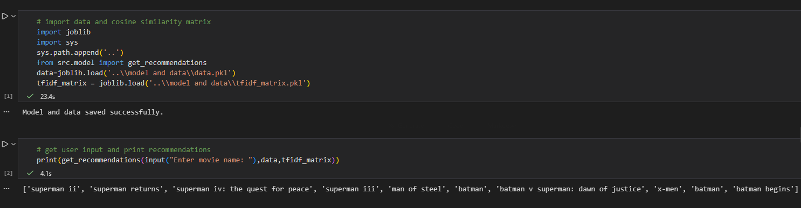

# Movie Recommendation System

## Overview
This project is a content-based movie recommendation system that suggests similar movies based on movie metadata.  
Instead of using user ratings, the system recommends movies by comparing content such as genres, keywords, cast, director, and plot overview.

The goal is to demonstrate how recommendation systems work using text representation and similarity measures.



---

## Dataset
**Source:** TMDB 5000 Movies Dataset (Kaggle)

The dataset contains information such as:
- Movie title
- Plot overview
- Genres
- Keywords
- Cast
- Crew (director)

---

## Project Structure
```
movie_recommendation_system/
│
├── data/
│ ├── tmdb_5000_movies.csv
│ └── tmdb_5000_credits.csv
│
├── notebook/
│ ├── main.ipynb # Data processing and model building
│ └── test.ipynb # Load saved model and test recommendations
│
├── model and data/
│ ├── data.pkl # Processed movie data
│ └── cosine_sim.pkl # Cosine similarity matrix
│
├── src/
│ └── recommender.py # Clean, runnable script
│
├── README.md
└── requirements.txt

```


---

## Approach
- Merged movie and credits datasets
- Selected relevant features such as genres, keywords, cast, director, and overview
- Used only the top 3 cast members to reduce noise
- Extracted only the director from crew data
- Normalized names by removing spaces to treat them as single tokens
- Combined all features into a single text column (`tags`)
- Converted text data into numerical vectors using TF-IDF
- Computed similarity between movies using cosine similarity

---

## Recommendation Logic
1. Convert each movie into a TF-IDF vector
2. Compute cosine similarity between all movie vectors
3. For a given movie, find the most similar movies based on cosine similarity
4. Return the top recommended movies excluding the input movie itself

---

## Why TF-IDF and Cosine Similarity
- **TF-IDF** reduces the impact of very common words and highlights important terms
- **Cosine similarity** measures how similar two movies are based on content direction rather than magnitude

---

## Making Recommendations
The system takes a movie title as input and returns a list of similar movies.

Example:
Enter movie name: interstellar

The system then returns the top recommended movies based on content similarity.

Prediction logic is demonstrated in:
- `notebook/test.ipynb`
- `src/recommender.py`

---

## Limitations
- No personalization (same recommendations for all users)
- Does not use user ratings or viewing history
- Full similarity matrix is not scalable for very large datasets

These limitations are expected for a content-based system and can be addressed using collaborative or hybrid approaches.

---

## Technologies Used
Python, NumPy, Pandas, Scikit-learn

---

## How to Run
1. Install dependencies:
pip install -r requirements.txt


2. Run the main notebook:
jupyter notebook notebook/main.ipynb


3. Test recommendations:
jupyter notebook notebook/test.ipynb

Or run the script:
python src/recommender.py


---

## Conclusion
This project demonstrates a practical implementation of a content-based recommendation system using text features and similarity measures.  
It highlights feature engineering, text representation, and recommendation logic without relying on user interaction data.


**Note:** The `cosine_sim.pkl` file is generated during runtime and excluded from version control due to size. It will be created automatically when you run the notebooks.
